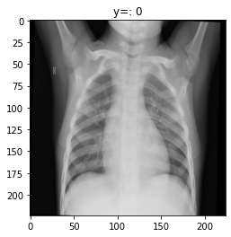
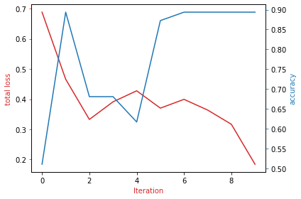

# Pneumonia or Normal Classification via IBM CV Studio

Transform for pretrained model: ResNet18

For more information about resnet18, please check [ResNet18 PyTorch](https://pytorch.org/vision/main/generated/torchvision.models.resnet18.html) website. Model generated by 234 Pneumonia and Normal X-Ray scans. You can find dataset on [Kaggle](https://www.kaggle.com/datasets/paultimothymooney/chest-xray-pneumonia).

### Dataset Overview with a Plot

     

Preprocess our dataset by changing the shape of the image, converting to tensor and normalizing the image channels. These are the default preprocessing steps for image data. In addition, we will perform data augmentation on the training dataset. The preprocessing steps for the test dataset is the same, but W do not prform data augmentation on the test dataset. 

    mean = [0.485, 0.456, 0.406]
    
    std = [0.229, 0.224, 0.225]
    
    composed = transforms.Compose([transforms.Resize((224, 224)), transforms.RandomHorizontalFlip(),transforms.RandomRotation(degrees=5) , transforms.ToTensor() , transforms.Normalize(mean, std)])

### Hyperparameters

#### Batch size

    batch_size=32

#### Learning rate

    lr=0.000001
    lr_scheduler=True
	base_lr=0.001
	max_lr=0.01

#### Number of epochs

    n_epochs = 10

#### Momentum

    momentum=0.9

### Plot of Train Cost and Validation Accuracy

     

**It may take a few minutes for the page to open. Please wait to complete your classification process.**

Link to test the classifier model: <a href="https://pneumonia-626d3286ef19609ba9594154.mr4ngdkhlwg.eu-gb.codeengine.appdomain.cloud/" target="_blank">Classification via IBM Cloud</a>

## Contact Me

If you have something to say to me please contact me: 

 - Twitter: [Doguilmak](https://twitter.com/Doguilmak)  
 - Mail address: doguilmak@gmail.com

## References

\[1] [Joseph Santarcangelo](https://www.linkedin.com/in/joseph-s-50398b136/?utm_medium=Exinfluencer&utm_source=Nurture&utm_content=000026UJ&utm_term=10006555&utm_id=SkillsNetwork-Courses-IBMDeveloperSkillsNetwork-CV0101EN-Coursera-25797139&utm_email=Email&utm_campaign=PLACEHOLDER) has a PhD in Electrical Engineering, his research focused on using machine learning, signal processing, and computer vision to determine how videos impact human cognition. Joseph has been working for IBM since he completed his PhD.

\[2]  Images were taken from: [https://homepages.cae.wisc.edu/\~ece533/images/](https://homepages.cae.wisc.edu/\~ece533/images/?utm_medium=Exinfluencer&utm_source=Nurture&utm_content=000026UJ&utm_term=10006555&utm_id=SkillsNetwork-Courses-IBMDeveloperSkillsNetwork-CV0101EN-Coursera-25797139&utm_email=Email&utm_campaign=PLACEHOLDER)

\[3]  <a href='https://pillow.readthedocs.io/en/stable/index.html?utm_medium=Exinfluencer&utm_source=Exinfluencer&utm_content=000026UJ&utm_term=10006555&utm_id=NA-SkillsNetwork-Channel-SkillsNetworkCoursesIBMDeveloperSkillsNetworkCV0101ENCoursera25797139-2021-01-01'>Pillow Docs</a>

\[4]  <a href='https://opencv.org/?utm_medium=Exinfluencer&utm_source=Exinfluencer&utm_content=000026UJ&utm_term=10006555&utm_id=NA-SkillsNetwork-Channel-SkillsNetworkCoursesIBMDeveloperSkillsNetworkCV0101ENCoursera25797139-2021-01-01'>Open CV</a>

\[5] Gonzalez, Rafael C., and Richard E. Woods. "Digital image processing." (2017).

\[6] Jian, Wushuai, Xueyan Sun, and Shuqian Luo. "Computer-aided diagnosis of breast microcalcifications based on dual-tree complex wavelet transform." Biomedical engineering online 11.1 (2012): 1-12.

\[6] [IBM AI Engineering, Course 3 - Introduction to Computer Vision and Image Processing](https://www.coursera.org/learn/introduction-computer-vision-watson-opencv?specialization=ai-engineer)

